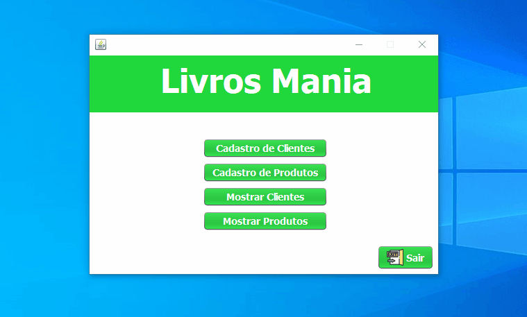

# Projetos-Java
 Neste repositório estão contidos arquivos/projetos de estudo sobre a linguagem Java
  
<h2>Como Executar os Projetos</h2>

 Para rodar os projetos é necessário ter instalado em sua máquina:

<ul>
    <li>App de Desenvolvimento/para rodar o projeto : NetBeans ou Eclipse
    </li>
    <li>App do Banco de Dados: MySQL Adiministrator, aqui é necessário que você carregue dentro o arquivo do banco de dados de cada projeto que deseja rodar/ver (que esta na pasta de cada um dos projetos)</li>
</ul>

 

<h2>Projeto Lojinha de Livros</h2>
