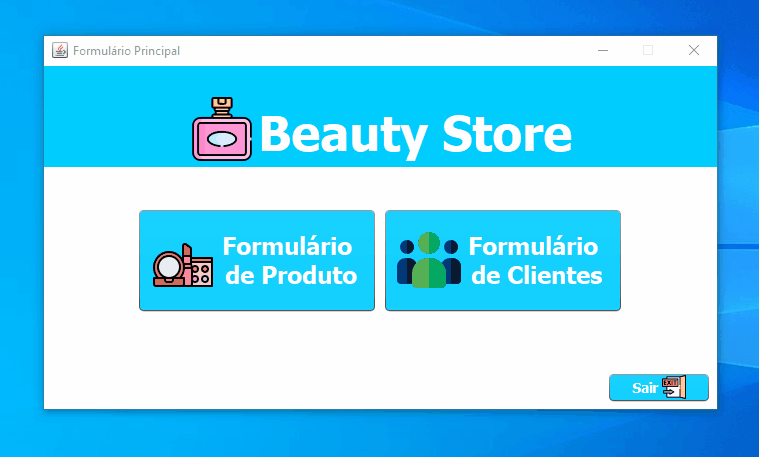

# Projetos-Java
 Neste repositório estão contidos arquivos/projetos de estudo sobre a linguagem Java
  
<h2>
<g-emoji class="g-emoji" alias="gear" fallback-src="https://github.githubassets.com/images/icons/emoji/unicode/2699.png">⚙</g-emoji>
Como Executar os Projetos
</h2>

 Para rodar os projetos é necessário ter instalado em sua máquina:

<ul>
    <li>App de Desenvolvimento/para rodar o projeto : NetBeans ou Eclipse
    </li>
    <li>App do Banco de Dados: MySQL Adiministrator, aqui é necessário que você carregue dentro o arquivo do banco de dados de cada projeto que deseja rodar/ver (que esta na pasta de cada um dos projetos)</li>
</ul>

 

<h2>
<g-emoji class="g-emoji" alias="computer" fallback-src="https://github.githubassets.com/images/icons/emoji/unicode/1f4bb.png">💻</g-emoji>
Projeto Lojinha de Livros
</h2>

 

<h2>
<g-emoji class="g-emoji" alias="computer" fallback-src="https://github.githubassets.com/images/icons/emoji/unicode/1f4bb.png">💻</g-emoji>
Projeto Loja de Beleza
</h2>

Formulário de Produtos

Formulário de Clientes

